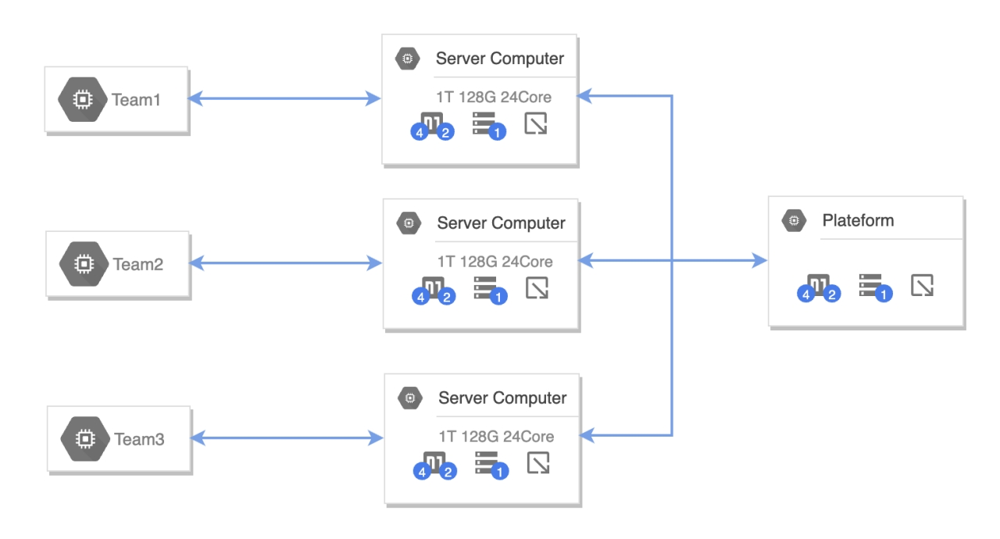
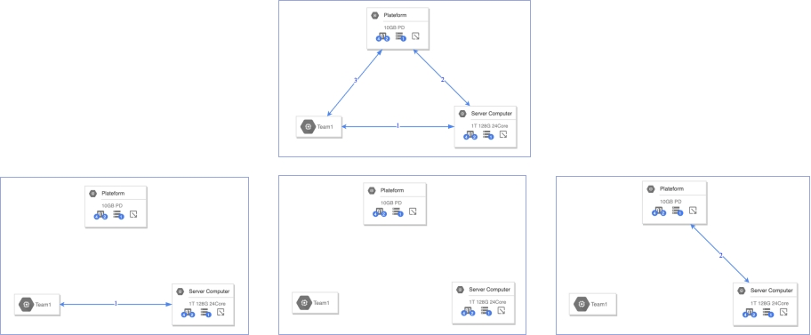
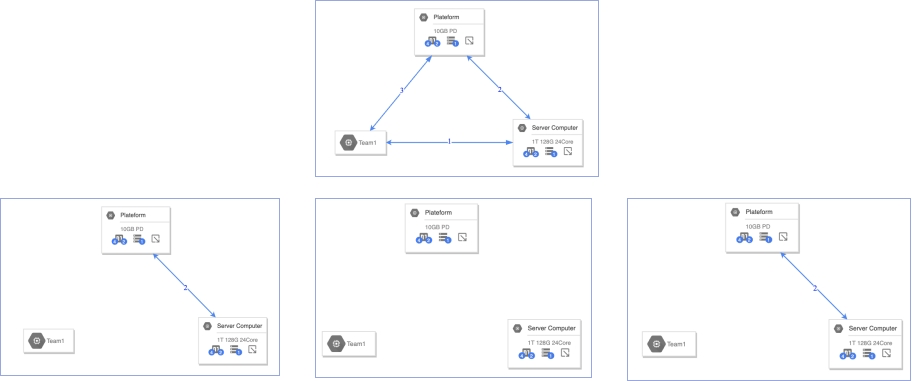
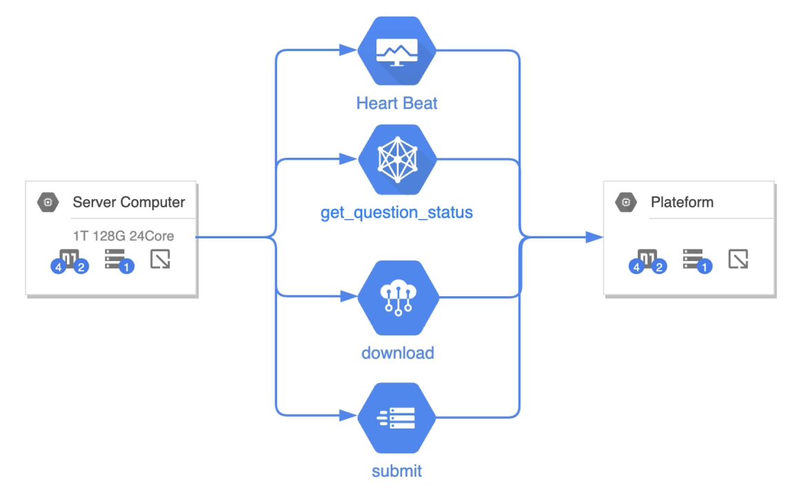
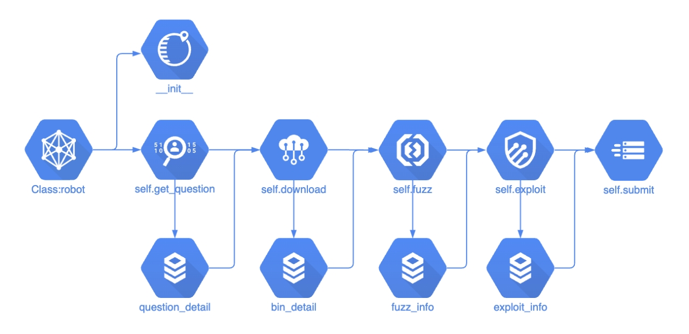
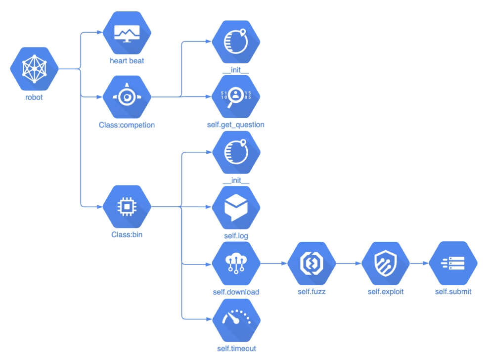
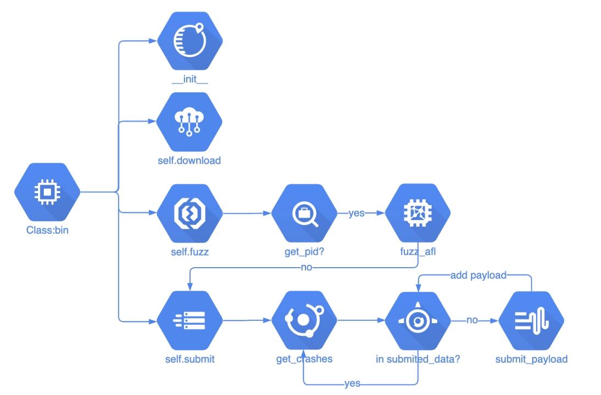
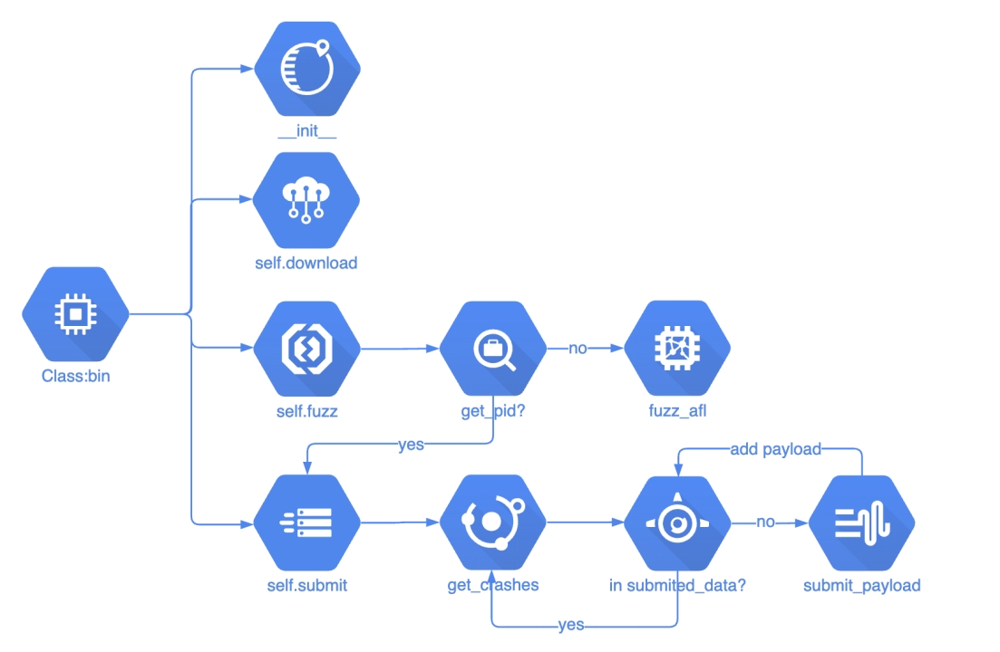

# RHG & AutoPwn Robot

## 赛制

国内现有的自动化攻防的比赛有bctf的autopwn，以及rhg比赛，这是国内主要的两场自动化挖掘利用的比赛，还有国外的CGC比赛，本文主要讲的是这两种比赛的Robot结构

下图是选手整体的一个接入图，选手是最左边的电脑，往右接入高性能服务器，高性能服务器接入比赛平台，这些服务器的性能是非常强悍的，所以robot要采用多进程，多并发的方式，这样才能让最大化利用高性能服务器。




### 赛制启动模式

赛事启动模式分为两种：

第一种

1、选手设备、服务器、平台互相联通
2、选手设备与服务器互相联通、选手设备及服务器均无法连同平台
3、选手设备、服务器、平台均不互相联通
4、选手设备无法联通其他，服务器、平台互相联通




第二种

1、选手设备、服务器、平台互相联通
2、选手设备无法联通其他，服务器、平台互相联通
3、选手设备、服务器、平台均不互相联通
4、选手设备无法联通其他，服务器、平台互相联通



这两者最大的区别是第二步，关键在于先独立平台，还是先独立选手设备，这两个要根据比赛赛前调试来修改。


### 平台交互





服务器和平台之间的交互内容，主要是有这四个交互，分别是心跳包，获取题目信息，下载附件，提交答案这四个功能，其他的功能都是服务器在内部进行运算的

### 提交内容

这两个赛制的最大的区别就是最后提交内容的区别：RHG需要提交的是flag，需要robot对靶机进行攻击，多了自动化利用（AEG）的功能；

```python
RHG：flag

{
user:"team1"
pwd:"pwd"
answer:"flag{1234}"
}
```

autopwn需要提交的是让elf崩溃的payload，payload需要base64编码一下。

```python
AutoPwn：payload

{
RoundID:1
user:"team1"
pwd:"pwd"
Payload:{
ChallengeID:"dc87311d"
Crash:"QUFBQUFBQUFBQQ=="
#Popcal:"QUFBQUFBQUFBQQ=="
}
}
```

当然，autopwn也有自动化利用Popcal的题目，目的也是自动化漏洞利用，控制EIP。但是今年的第一场autopwn的题目只有crashme类型，所以本文主要涉及crashme的内容。

需要注意的是，autopwn提交时需要提交RoundID，所以提交是需要获取一下当前的round_id，否则比如说fuzz了半个小时才出结果，而轮次都更新3轮了，提交fuzz时的轮次会失败。


## 结构框架



上图是之前使用的框架，定义了robot的类，包括了图中这些方法，这些方法都是单线的流程走下去的，先调用get_question获取题目信息，然后保存成文件，然后再调用download，同时读取之前保存的题目细节文件，再通过download保存bin细节文件，所有的题目下载完成后，然后调用fuzz，所有的fuzz结束后，保存fuzz_info，之后才会调用exploit，所有的exploit结束后，最后调用submit提交答案。
这个结构有很多问题，中间有任何一个流程出现了问题，会导致后续的流程全部中断，比如一个二进制下载出问题，会导致所有的题目都无法fuzz；
不过这个结构很好作并发，所有的并发只要读取上一阶段的保存信息，然后批量执行就行，多进程并发会容易很多；
但容错性和鲁棒性都很差。



上图是修改后的结构框架，定义一个机器人，然后心跳包单独出去，定义competion类，用来执行题目信息获取。然后robot根据获取的题目信息，生成大量的bin实例，每个实例都有自己的下载、fuzz、exploit、提交等功能，每个bin都是多进程并发出去的。
这样的话，每个bin的工作流程都互相不影响，即便是有一个出现问题，其他bin都会照常运行，稳定性要高很多。



这是bin类主要功能的流程，初始化然后下载，下载完成执行fuzz，最后执行submit提交

### 安装部署

docker-compose

```yaml
#docker-compose.yml
version: '3'
services:
  robotcontainter:
    build:
      context: .
      dockerfile: Dockerfile
    privileged: true #root权限
```

为了robot的移植性比较好，所以采用了docker-compose部署。这是docker-compose.yml的文件，主要的是最后一行，privileged设置为true，这样给了docker容器最大的权限来调用外部资源

Dockerfile

```c
FROM ubuntu:16.04
 
RUN sed -i "s/http:\/\/archive.ubuntu.com/http:\/\/mirrors.tuna.tsinghua.edu.cn/g" /etc/apt/sources.list
RUN sed -i "s/http:\/\/security.ubuntu.com/http:\/\/mirrors.tuna.tsinghua.edu.cn/g" /etc/apt/sources.list
 
RUN apt-get update && apt-get -y dist-upgrade
RUN apt-get install -y lib32z1 xinetd
RUN apt-get install -y openssh-server vim zsh git curl wget
 
RUN apt-get install -y python python-dev python-pip python-numpy
RUN apt-get install -y libtool libtool-bin automake bison libglib2.0-dev
 
#更改pip源
RUN mkdir /root/.pip
RUN echo "[global]\nindex-url = https://pypi.tuna.tsinghua.edu.cn/simple\n[install]\ntrusted-host=mirrors.aliyun.com" > /root/.pip/pip.conf
 
RUN pip install requests numpy
 
# oh-my-zsh
RUN sh -c "$(curl -fsSL https://gitee.com/awwwj/zsh/raw/master/install.sh)"
 
# 指定文件夹
WORKDIR /home/ctf
 
# 写入配置文件
RUN mkdir /home/ctf/robot
COPY ./robot /home/ctf/robot
COPY ./start.sh /
 
# 配置afl-fuzz
RUN chmod 755 /home/ctf/robot/afl-fuzz/setup.sh
WORKDIR /home/ctf/robot/afl-fuzz
RUN sh -v -c /home/ctf/robot/afl-fuzz/setup.sh
 
 
# 给start.sh可执行权限
RUN chmod 755 /start.sh
 
#启动docker
CMD ["/start.sh"]
```

dockerfile安装了lib32z1等一系列依赖，这里我们使用的python版本还是2.7的版本，后续会考虑移植到python3的版本，最下面更改了pip的源，然后安装robot的pip依赖

这边安装了一下oh-my-zsh，ubuntu自带的bash终端太难用了，在输入命令上话费很多时间，这里用的是gitee，不是用的gitlab，现在很多地区访问github拉文件是都被ban了，要么超时，要么访问不了。
再下面就是拷贝robot文件，配置fuzz程序的安装脚本，最后启动start.sh脚本。

## 接口分析

### 平台题目信息分析

下面是RHG平台返回的题目信息

```json
{"AiChallenge":
    [{"challengeID":1
        "vm_ip":"172.16.7.13"
        "vm_name":"Defcon-AI-test-Release-1-ZegaKdFm"
        "question_port":"9001"
        "binaryUrl":"https:\/\/172.20.1.1\/resources\/file\/bff4819cbce2f8e6"
        "flag_path":"\/home\/flag1.txt"
        "first_blood":"3"
        "current_time":1616917575
        "attacks_count":"7"
        "current_score":100
        "score":130
        "question_type":"1"},
    {"challengeID":2,"vm_ip":"172.16.7.13","vm_name":"Defcon-AI-test-Release-1-ZegaKdFm","question_port":"9002","binaryUrl":"https:\/\/172.20.1.1\/resources\/file\/7bb1dc381ac3e13a43","flag_path":"\/home\/flag2.txt","first_blood":"1","current_time":1616917575,"attacks_count":"1","current_score":130,"score":0,"question_type":"1"}],
"PointsInfo":{"aiPoints":"280"},
"status":1}
```


这里针对RHG的题目包分析，可以使用cURL和requests来处理。如果使用curl会很容易操作，但是对于接受回显回比较难。requests比较推荐，首先定义一下header，然后发送get请求就行，但是需要注意的是，该请求需要对用户名密码验证，验证方法base64编码就行。另外需要注意timeout和verify。
verify是取消https证书验证，线上测试的时候证书一般都是没问题的，但是线下比赛时，都是内网ip地址，https肯定会报错，需要取消证书验证。

`curl -k -X GET –user user:pwd https://rhg.ichunqiu.com/rhg/api/get_question_status`

```python
def get_question(self):
    try:
        basic = self.username+':'+self.password
        auth=base64.b64encode(basic.encode("utf-8")).decode()
        header = {"Authorization": "Basic "+auth,'User-Agent':'Mozilla/5.0 (Windows NT 10.0; Win64; x64) AppleWebKit/537.36 (KHTML, like Gecko)     Chrome/52.0.2743.116 Safari/537.36 Edge/15.15063'}
        resp = requests.get(self.url_get_question, headers=header, timeout=5, verify=False)
        self.gamestatus = json.loads(resp.content)['status']
        self.challenge = json.loads(resp.content)["AiChallenge"]
    except Exception as e:
        self.log(str(e))
        self.challenge = 0
        self.gamestatus = 0
```

下面是AutoPwn平台返回的题目信息

```json
{"CurrentRound":1,
    "CurrentChallenge":[
        {"cb_id":"061837cd",
        "score":3,
        "score_method":"Crash",
        "cb_url":"https://anquan.baidu.com/bctf/bctf_games/061837cd.tar",
        "cb_provider":"team_a"},
{"cb_id":"0f3abf1d","score":3,"score_method":"Crash","cb_url":"https://anquan.baidu.com/bctf/bctf_games/1/ad8d413d/1458.tar","cb_provider":"team_a"}],
"scoreboard":[
    {"score":99,"first_blood":15,"bugs":20,"rank":1,"team":"test3"},
    {"score":63,"first_blood":2,"bugs":4,"rank":3,"team":"test1"}]}
 


```

这是autopwn的题目信息接口，可以看到和rhg还是有一些差别的，首先多了round轮次，autopwn中轮次是非常重要的，同时没有给ip和端口，因为autopwn是不需要机器人攻击平台上的靶机的，只需要把payload提交给平台，平台自行验证，还有一个区别就是cb_url，rhg下载下来就是二进制elf，而autopwn下载下来是tar的压缩包，所以还需要下载接口写一个解压的功能

`curl  https://anquan.baidu.com/bctf/latest_round `

```python
def get_question(self):
    try:  
        header = {'User-Agent':'Mozilla/5.0 (Windows NT 10.0; Win64; x64) AppleWebKit/537.36 (KHTML, like Gecko)     Chrome/52.0.2743.116 Safari/537.36 Edge/15.15063'}
        resp = requests.get(self.url_get_question, headers=header, timeout=5, verify=False)
        ret_con = json.loads(resp.content)
        self.challenge = ret_con['CurrentChallenge']
        self.round = ret_con['CurrentRound']
        return True
    except Exception as e:
        log(str(e))
        return False
```

这是AutoPwn的题目请求方法，autopwn这里不需要用户名和密码，直接requests get就可以了，同样需要注意超时和https的问题。整个方法的返回是true和false，用来判断比赛是否开始，还没开始的话，获取challenge和round都会报错，直接返回false。

### 心跳包接口

```python
import requests
from requests.auth import HTTPBasicAuth
import base64
import json
import time
import threading
 
def run(url_heartbeat,username,password):
    while 1:
        try:
            ...
            resp = requests.get(url_heartbeat,headers=header,timeout=5, verify=False)
            ...
def heartbeat(url_heartbeat='api/heartbeat',username='student01',password='KayVdf'):
    t1 = threading.Thread(target=run,args=[url_heartbeat,username,password])
    t1.start()
 
if __name__ == '__main__':
    heartbeat(url_heartbeat='api/heartbeat',username='student01',password='KayVdf')
```

这个是心跳包的接口，发给平台，证明机器人还存活着。
这里用的是threading多线程起了服务，不影响主要的功能运行，因为是大量的sleep，在多线程中不会去抢GIL锁，所以多线程就行，不需要起多进程

### 下载接口

RHG

```python
def download(self):
    try:
        self.dir = "attachments/"+str(self.id)
        os.system("wget {url} -O {dir} --no-check-certificate --timeout=10 --tries=3".format(url = self.download_url,dir = self.dir ))
        if os.path.isfile(self.dir):
            self.log(self.dir + " download ok")
 
        else:
            self.log(self.dir + " download failed")
 
    except Exception as e:
        self.log(self.dir + " download failed")
```

这个是rhg下载的接口，需要根据二进制的id确定保存位置，根据dir确定下载位置。
需要注意的是--no-check-certificate也是跳过https的验证，防止证书出问题。给了超时，还有tries=3，这是为了防止比赛刚开始，所有队伍访问平台，肯定会卡，所以多给几次重试。
RHG的平台下载下来就是二进制elf文件，比较好弄一些


AutoPwn

```python
def download(self):
    try:
        self.dir = "attachments/"+str(self.id)
        self.bin_dir = self.dir+"/cb"
        self.bin_in = self.dir+"/in"
        self.bin_out = self.dir+"/out"
        self.submited_data = self.dir+"/submited.txt"
        file_addr = self.dir +"/"+ str(self.id)

        # 先检测本地是否已经下载
        if not os.path.isfile(self.bin_dir):
            os.system("mkdir "+self.dir )
            os.system("wget {url} -O {dir} --no-check-certificate --timeout=10 --tries=3".format(url = self.download_url,dir = file_addr ))
            os.system("tar xvf {file_addr} -C  {dir}/ --strip-components=1".format(file_addr = file_addr,dir = self.dir ))
        if not os.path.isfile(self.bin_dir):
            os.system("cp "+ self.dir+"/bin/cb " + self.bin_dir)
        if not os.path.isdir(self.bin_out):
            os.system("mkdir "+ self.bin_out)
        if not os.path.isfile(self.submited_data):
            os.system("touch "+ self.submited_data)
        if not os.path.isdir(self.bin_in):
            os.system("cp -r "+ self.dir+"/seed " + self.bin_in)
            #拷贝以前的seed
            os.system("cp ./seed/* "+self.bin_in)
        #可能还需要解压功能
        if os.path.isfile(self.bin_dir):
            self.log(self.dir + " download ok")
            return True
        else:
            self.log(self.dir + " download failed")
            return False
    except Exception as e:
        self.log(self.dir + " download failed")
        return False	
```

这是AutoPwn的下载接口，比rhg的复杂一些，主要是因为autopwn提供的是tar的压缩包，所以需要脚本进行解压。
先看一下定义的几个属性：
dir是一个题目的总文件夹，用题目id来命名
bin_dir是解压后的二进制位置
bin_in是fuzz input文件夹
bin_out是fuzz output文件夹
submited_data是验证哪些payload已经提交过了
file_addr是下载的压缩包后重命名的名称
检测是否已经下载，如果没下载的话，执行新建文件夹，下载压缩包，解压重命名，这里有一个参数比较特别，--strip-components=1,目的是去除掉第一层目录结构，具体看下面的对比

```shell
➜  test git:(master) ✗ file 061837cd
061837cd: POSIX tar archive (GNU)
➜  test git:(master) ✗ tar xf 061837cd
➜  test git:(master) ✗ tree
.
├── 061837cd
└── crashme_bctf_01
     ├── Dockerfile
     ├── bin
     │   └── cb
     └── seed
         └── sample.in
3 directories, 4 files
```

```shell
➜  test git:(master) ✗ tar xf 061837cd --strip-components=1
➜  test git:(master) ✗ tree
.
├── 061837cd
├── Dockerfile
├── bin
│   └── cb
└── seed
    └── sample.in
2 directories, 4 files
```

从上面可以看到，下载下来的附件是tar的压缩包，如果直接tar xf解压的话，第一层会有一个crash_bctf_01文件夹，这个文件夹会有一定的有随机性，用正则匹配的话不一定稳定，所以加上--strip-components=1去掉第一层文件夹，文件夹部署就规律一些了，后面的文件夹就好处理了

### AFL Fuzz 接口

AFL类

```python
class AFL(object):
    def __init__(self, id, binary, afl='/home/robot/afl-2.52b/afl-fuzz', debug=False):
        self.__id = id
        self.bin_addr = binary
        self.afl_bin_addr = afl
        self.afl_dir = os.path.dirname(afl)
        self.bin_dir = os.path.dirname(binary)
        self.in_dir = os.path.join(self.bin_dir, 'in')
        self.out_dir = os.path.join(self.bin_dir, 'out')
        self.dic_dir = os.path.join(self.bin_dir, 'dic')
        self.__debug = debug
```


首先定义了AFL的一个类，参数中有afl的绝对地址，尽量不要用相对地址，否则查半天报错都找不到原因，。其他几个就是二进制的位置和输入输出文件夹，dic是一些字典，可以自定义

AFL Fuzz 接口

```python
def start(self):
    if not os.path.exists(self.in_dir):
        os.mkdir(self.in_dir)
        with open(os.path.join(self.in_dir, 'NEURON.txt'), 'w') as f:
            f.write('NEURON')
    if os.path.exists(self.out_dir+"/crashes"):
        self.in_dir = '-'
 
    os.chmod(self.bin_addr, 0775)
    else:
        self.__afl_process = subprocess.Popen(["screen -dmS {id} bash -c '{afl_path} -i {input} -o {output} -x {dic} -m none -Q -- {bin}'".format(id=self.__id,afl_path=self.afl_bin_addr,input=self.in_dir,output=self.out_dir,dic=self.dic_dir,bin=self.bin_addr )],shell=True, stdout=subprocess.PIPE)
```

start方法定义了fuzz启动程序，首先判断input是否为空，防止主办方发来的seed文件夹里面是空的，空的会导致无法fuzz成功，为空的话就随便写点东西进去。

第二个判断先前是否fuzz出crash，如果有的话，将`input_dir`替换为`-`

再往下就是给775的权限，然后就调用了subprocess，单独启一个进程，这个进程并不是直接启动afl-fuzz，而是启动了一个screen的进程，screen这里主要的目的包括：不显示fuzz的大量回显；主进程异常退出后，fuzz进程仍然在screen里运行；方便screen -r进入，调试fuzz程序。用的参数就是screen -dmS 分屏名称 bash -c 
最内层的是fuzz的命令
afl-fuzz -i input -o output -x dic -m none -Q -- bin
这里-m是指定内存限制，设置为none，-Q是指定在Qemu虚拟机里运行，因为主办方给的bin都没有插过桩，只能用qemu来运行

AFL Fuzz Qemu安装

```bash
#!/bin/sh
 
tar xvf ./afl-latest.tgz;
cd ./afl-2.52b;
make;
make install;
 
cd ./qemu_mode;
apt-get install libtool libtool-bin automake bison libglib2.0-dev -y
export CPU_TARGET=i386;
./build_qemu_support.sh;
```

这里插入一下AFL Fuzz的安装，以及Qemu的安装
afl的安装比较简单，直接tar解压后，make&make install就行。
qemu的安装要进入afl里qemu_mode的文件夹里，执行build_qemu_support.sh文件，但是执行的时候需要提前手动安装依赖
安装完依赖之后，需要确定robot的环境是x86还是64位，如果是x86 32位的话，就可以不用添加这个环境变量。
如果是64位的话，必须要添加这个环境变量，不加的话，会安装64位的qemu，而平台下发的二进制基本上都是32位的，在64位qemu里无法运行，而且没有任何报错的回显，完全不知道错在哪里

```python
#AFL Fuzz 接口

def main(id,file_name):
    try:
        afl_path = "/home/ctf/afl-2.52b/afl-fuzz"
        start_time = time.time()
        max_run_time = 7200
        afl = AFL(id,file_name, afl=afl_path, debug=False )
        afl.start()
        while True:
            if time.time() - start_time >max_run_time:
                break
            time.sleep(10)
        self.__afl_process.kill()
    except Exception as e:
        print(str(e))
        print("fuzz failed")
 

```

这个是afl fuzz 主函数，定义的延时是2个小时，afl.start（）启动后，会一直等待时间结束,时间到了之后便会强制结束fuzz的进程

这里需要提一下平台赛题发放的一个坑。
AutoPwn平台每10分钟为一轮，更新轮次和题目内容，但是平台并不是每一轮都会更新题目的。这个也是autopwn和rhg的一个大差别，rhg一轮一个小时左右，所以rhg对轮次并不敏感。但是autopwn每10分钟一轮，如果我们的robot也是10分钟重新下载题目，停止掉上一轮fuzz的进程，再启动新的fuzz进程，就会浪费非常多的时间在fuzz进程的启动和重启上。平台是将近2个小时才会真正更新一轮题目。所以这里robot中的fuzz和crash检测是异步结构，这也是为什么10分钟一轮，fuzz的超时却设置成了2个小时

同步处理crashes

```python
def main(id,file_name):
    try:
        afl_path = "/home/ctf/afl-2.52b/afl-fuzz"
        start_time = time.time()
        max_run_time = 7200
        afl = AFL(id,file_name, afl=afl_path, debug=False )
        afl.start()
        self.crashes = afl.crashes()
        while True:
            if time.time() - start_time >max_run_time:
                break
            time.sleep(10)
            tmp = afl.crashes()
            if self.crashes != tmp:
                self.crashes = tmp
        self.__afl_process.kill()
    except Exception as e:
        print(str(e))
        print("fuzz failed")
 
```


上面是以前同步处理crashes的方法：这里获取crashes的方法是嵌入fuzz的方法里的，crash会在fuzz结束后检测并返回给robot。这样的写法问题非常多，比如：robot异常结束后，重启robot无法获取到crashes，除非重启整个fuzz进程；返回的时候是全部crashes返回，而不是只返回新增加的crashes，这在提交flag时也是一个坑

### 异步处理crashes

```python
def main(id,file_name):
    try:
        afl_path = "/home/ctf/afl-2.52b/afl-fuzz"
        start_time = time.time()
        max_run_time = 7200
        afl = AFL(id,file_name, afl=afl_path, debug=False )
        afl.start()
        while True:
            if time.time() - start_time >max_run_time:
                break
            time.sleep(10)
        self.__afl_process.kill()
    except Exception as e:
        print(str(e))
        print("fuzz failed")
 
```

重新设计的结构是异步结构，fuzz只负责fuzz功能，crash由其他功能负责。

```python
#异步处理crashes
def get_crashes(self):
    try:
        if not os.path.exists(self.bin_out+ "/" +"crashes"):
            return []
        crashes=[]
        for crashes_dir in os.listdir(self.bin_out):
            if crashes_dir.find("crashes") != -1:
                for crash in os.listdir(self.bin_out+ "/" +crashes_dir):
                    if crash != 'README.txt':
                        crashes.append(self.bin_out+ "/" +crashes_dir+ "/" +crash)
        if crashes != self.crashes:
            last_crashes = self.crashes
            self.crashes = crashes
            for crash in last_crashes:
                crashes.remove(crash)
            self.new_crashes = crashes
        else:
            self.new_crashes = []
    except Exception as e:
        print(str(e))
```

上面是异步获取crashes的方法：
首先判断是否生成了crashes文件夹，如果没有，说明没有fuzz出crashes，直接结束该方法；如果有该文件夹，就开始遍历out文件夹里所有的crashes文件夹，再遍历每个crash文件夹里的payload，还得排除掉readme文件。
这里第一层遍历的是out文件夹，而不是直接遍历crashes文件夹的原因是：当第一次fuzz出crash之后，fuzz进程被停止，第二次重新fuzz后，会将原crashes文件夹重命名为crashes+时间，会形成多个crashes文件夹

```shell
➜  out ls
crashes
crashes.2021-06-04-05:43:06
crashes.2021-06-04-06:12:22
crashes.2021-06-04-08:13:14
crashes.2021-06-04-09:11:09
 
```

再往下会对比新获取的crashes和之前的crashes是否相同，如果相同就更新self.crashes，并更新new_crashes，这个new_crashes会用在后面的submit功能里。

异步处理crashes

```python

def get_pid(self,pid_name):
    try:
        p = subprocess.Popen(["ps -ef | grep -v 'grep'  | grep '"+pid_name+"' |  awk '{print $2}' "], shell=True,close_fds = True,stdout=subprocess.PIPE)
        list = p.stdout.readlines()
        if len(list) != 0:
            return True
        else:
            return False
    except Exception as e:
        return False
 
def fuzz(self):
    try:
        if not self.get_pid(self.id):
            self.log(self.dir + " start fuzz")
            print(self.bin_dir,self.bin_in,self.bin_out)
            fuzz_afl.main(self.id,self.bin_dir)
        else:
            self.log(self.dir + " is fuzzing in backend")
    except Exception as e:
        print(str(e))
 

```

刚刚是异步获取crashes的方法，还需要的就是一直fuzz的异步功能，这里的get_pid和fuzz是bin类的方法，先看get_pid，参数为pid名称，使用ps -ef来获取匹配进程，其中需要注意的是grep -v 'grep'，这是排除掉grep本身命令对搜索进程的影响，把stdout结果赋值给list，当list长度不为0时就说明当前系统中，存在本题目id的fuzz进程。下面的fuzz方法检测了pid，存在pid的话就不进行fuzz，不存在的话就会新建上面的AFL fuzz类。
这样的逻辑就是为了让fuzz能够一直不受影响的运行下去，而不会每次轮次更新时就被打断重新运行。


### 提交接口

```python
def submit_payload(payload,id,round,username,password,url_submit_flag):
    try:
        template = {"RoundID":round,
            "Payload":{
            "ChallengeID":id,
            "Crash":payload}}
        submit_data = {"username": username, "password": password, "verify": template}
        temstr = json.dumps(submit_data)
        headers = {'User-Agent': 'Mozilla/5.0'}
 
        ret = requests.post(url_submit_flag, json = submit_data, headers=headers,timeout = 30)
        return ret.json()['error_code']
    except Exception as e:
        print(str(e))
        return 1
```

这个是submit的方法，内容比较简单，按照官网的要求编写json就行，Crash记得要base64编码，这里需要注意的是，submit返回的内容是json里error_code的，可以看最下面几个典型的error_code，0代表提交成功，125代表重复提交，126代表提交过快，间隔时间为60s。

```json
{u'error_eng': u'ok', u'error_code': 0, u'error_chn': u'ok'}
{u'error_eng': u'duplicate submit data', u'error_code': 125, u'error_chn': u'使用同一份答案提交'}
{u'error_eng': u'one submition in 60 seconds', u'error_code': 126, u'error_chn': u'提交flag过于频繁'} 
 
```

也正是因为它提交间隔60s非常长，所以还需要我们对提交的crash修改，只提交新的crashes，提交过的crash和出现过重复提交的crash，以后将不再提交，否则当总crashes超过10个的时候，后面新的crashes将都无法提交。当然，60s间隔是针对同一个题目的，如果是针对所有题目的提交接口的话，那就没法写多进程并发了。

```python
from sub_answer import submit_payload
def submit(self):
    try:
        self.get_crashes()
        if self.new_crashes != []:
            submited_data = open(self.submited_data,"r").read().split("\n")
            for crash in reversed(self.new_crashes):
                payload = base64.b64encode(open(crash,"rb").read())
                if payload in submited_data:
                    continue
                error_code = submit_payload(payload,self.id,self.round,name,password,self.url)
                if error_code==125 or error_code==0:
                    open(self.submited_data,"a").write(payload+"\n")
                sleep(61)
            self.log(self.dir + " submit success")
    except Exception as e:
        print(str(e)) 
```

这是bin类中submit的方法，刚刚是submit的一个函数，调用了刚刚的submit_payload函数，这个方法里，首先调用了get_crashes，然后判断new_crashes是否为空，为空就结束submit，如果不为空，则对new_crashes列表进行反序提交，反序提交的目的是将最新的crash优先提交。之后便是读取submited_data，这个是代表已重复提交的crash payload，将new_crashes里的内容和submited_data匹配，如果提交过就跳过，没提交过的话调用submit_payload，并判断返回的error_code，error_code 是125就代表重复提交，就需要在submited_data再添加最新的，同样返回0的时候也判断为提交成功，同样需要加入submited_data，然后等待61秒，平台提交间隔是60s，多一秒稳妥一点



bin主流程

```python
def attack(self):
    self.download()
    self.fuzz()
    for i in range(0,300/5):
        self.submit()
        sleep(5)
 
def timeout(self):
    for i in range(self.time_limit):
        sleep(1)
    self.p.terminate()
    print("sorrry, timeout")
 
def auto(self):
    self.p = Process(target=self.attack) #, args=(str(i),))
    self.k = Process(target=self.timeout)
    self.p.start()
    self.k.start()
 
```

这是bin类的主流程了，调用了Process启用了多进程，attack是bin的流程结构，先下载二进制，然后调用fuzz。

fuzz使用的是afl-fuzz，而rhg的exploit主要是用zeratool来进行aeg攻击，zeratool有局限性，它是基于afl-fuzz和angr来运行的，所以依赖于符号表，对于静态编译或者strip掉符号表的题目，会出现路径爆炸等特殊情况。zeratool大家感兴趣的话可以自己看看

`https://github.com/ChrisTheCoolHut/Zeratool.git`

另外exploit还有一种方式就是利用特征化脚本，这个本质上有点离谱，那就是收集大量的exp脚本，写好对应的接口，拼的就是谁的脚本库大。这个方法往往有奇效，毕竟历史总是惊人的相似，这年头用往届原题的比赛数不胜数

## 异常处理

### 异常及log记录

```python
def log(self,content):
    try:
        f = open("log.txt","a")
        f.write(content+"\n")
        f.close()
    except Exception as e:
        return 0
        
def download(self,round_current=1):
    try:
        os.system("wget url -O dir --no-check-certificate --timeout=10 --tries=3")
        if os.path.isfile(self.dir):
            self.log(self.dir + " download ok")
 
    except Exception as e:
        self.log(self.dir + " download failed:"+str(e))
```


### 异常类型

访问平台失败

* 平台ping不通
* request超时
* https证书验证失败


题目信息解析失败

* request 返回的json格式问题

  


round异常


* round提前
* round推后

> 解决方法根据error_code，如果显示round异常，就需要根据实际时间来判断轮次


下载题目失败


* 下载https证书问题
* wget超时
* 下载为空文件

> 空文件是轮次错误导致，获取url时侯比如说是 9分59秒，下载的时候是10分01秒，这个时候之前的下载连接就会下载为空文件了，判断空文件时，需要调用轮次获取，重新下载


编译方式

* 动态编译

> 动态编译需要提前安装大量依赖库

```c
lib库
lib32z1
libboost-all-dev
lib32ncurses5
libncurses5-dev
libstdc++6 
lib32stdc++6
libffi-dev
```

* 静态编译


fuzz失败

* fuzz无法启动
* 超时
* memory error
* seed崩溃


exploit失败


* 编译类型
* libc版本


submit失败


* flag错误
* 重复提交
* 提交过快
* round 错误


比赛开始判定

* ping判定
* 时间判定
* request返回判定


比赛期间平台突然与服务器的连接

* robot 异常

* 每一轮检查比赛是否开始

* damon 守护程序

以上只是部分异常的原因和处理方式，异常的处理在整个robot的结构中非常重要，前面提到的fuzz和exploit决定了分数的高低，而异常的处理决定了分数是否为0